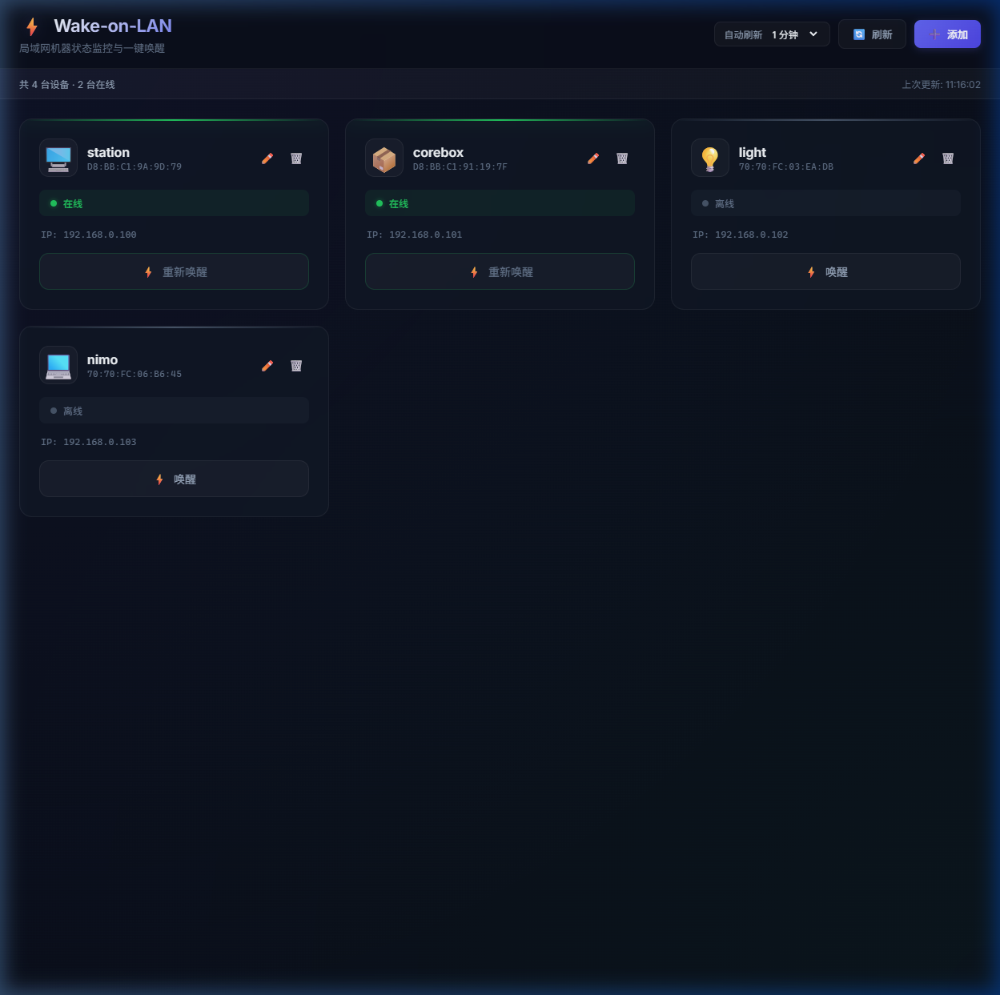

<div align="center">

# ⚡ Wake Master

### 局域网机器管理神器 | LAN Machine Manager

**一键唤醒、关机、重启你的所有设备，告别繁琐的路由器后台操作！**

**Wake, shutdown, and restart all your LAN devices with a single click!**

[](https://github.com/nimoshaw/wake_master/stargazers)
[](LICENSE)
[](#-clients)

<br>



<br>

**如果 Wake Master 帮到了你，请给个 ⭐ Star 支持一下！**

**每一个 Star 都是我们继续开发的动力 🚀**

[中文](#-功能亮点) · [English](#-features) · [Download](#-quick-start) · [Agent/IDE Integration](#-agentide-integration)

</div>

---

## 😤 你是不是也受够了？

每次要唤醒一台机器，就得：

1. 🔗 打开路由器管理页面
2. 🔑 输入密码登录
3. 📂 翻好几层菜单找到"网络唤醒"
4. 🖱️ 找到对应机器，点击唤醒
5. 🔁 再来一次？重复以上步骤…

**Wake Master 把这一切变成一个按钮的事！**

---

## ✨ 功能亮点

| 功能 | 说明 |
|------|------|
| ⚡ **一键唤醒** | WOL Magic Packet，秒级唤醒局域网内任意机器 |
| 📊 **实时状态** | 自动 Ping 检测在线/离线，可配置自动刷新 |
| 🔌 **远程关机** | P2P 协议 + 组密码认证，一键远程关闭目标机器 |
| 🔄 **远程重启** | P2P 协议 + 组密码认证，一键远程重启目标机器 |
| 📡 **局域网扫描** | 自动发现同网段设备，一键添加 |
| 🔒 **组密码验证** | HMAC-SHA256 签名认证，防止未授权操作 |
| 🚀 **开机自启动** | 保持后台运行，随时接收远程指令 |
| 📤 **导入/导出** | 机器配置一键导出导入，轻松迁移 |
| 🐳 **Docker 部署** | 支持 NAS / Linux 服务器一键部署 |
| 🎨 **暗色主题** | Glassmorphism 设计，赏心悦目 |
| 📱 **响应式布局** | 手机、平板、桌面全适配 |
| 🤖 **AI Agent 集成** | MCP Server + CLI，让你的 AI 助手帮你管机器 |

## ✨ Features

| Feature | Description |
|---------|-------------|
| ⚡ **One-Click Wake** | WOL Magic Packet — wake any machine on your LAN instantly |
| 📊 **Live Status** | Auto ping detection with configurable refresh |
| 🔌 **Remote Shutdown** | P2P protocol with group password HMAC auth |
| 🔄 **Remote Restart** | P2P protocol with group password HMAC auth |
| 📡 **LAN Scan** | Auto-discover devices on your network |
| 🔒 **Group Password** | HMAC-SHA256 authentication to prevent unauthorized access |
| 🚀 **Auto-Start** | Start on boot to always accept remote commands |
| 📤 **Import/Export** | One-click config backup and restore |
| 🐳 **Docker** | One-command deployment for NAS / Linux servers |
| 🎨 **Dark Theme** | Glassmorphism design that looks stunning |
| 📱 **Responsive** | Works on phones, tablets, and desktops |
| 🤖 **AI Agent Ready** | MCP Server + CLI for AI coding assistants |

---

## 📦 Clients

Wake Master runs everywhere:

| Platform | Technology | Status |
|----------|-----------|--------|
| 🌐 **Web** | Node.js + Express | ✅ Ready |
| 🖥️ **Windows** | Tauri 2 + Rust | ✅ Ready |
| 🍎 **macOS** | Tauri 2 + Rust | ✅ Ready |
| 🐧 **Linux** | Tauri 2 + Rust | ✅ Ready |
| 📱 **Android** | Kotlin + Jetpack Compose | ✅ Ready |
| 📱 **iOS** | SwiftUI + Network.framework | ✅ Ready |
| 🤖 **CLI / Agent** | Node.js MCP Server | ✅ Ready |

---

## 🚀 Quick Start

### 🌐 Web Version (Fastest!)

```bash
git clone https://github.com/nimoshaw/wake_master.git
cd wake_master
npm install
npm start
# 🎉 Open http://localhost:3000
```

### 🖥️ Desktop (Windows / macOS / Linux)

**Pre-built releases:**
Download from [Releases](https://github.com/nimoshaw/wake_master/releases)

**Build from source:**
Requires [Node.js](https://nodejs.org/) 18+ and [Rust](https://rustup.rs/) 1.70+

```bash
cd clients/desktop
npm install
cargo tauri dev      # Dev mode
cargo tauri build    # Build installer
```

**Build targets:**
- Windows: `.exe` (NSIS) / `.msi`
- macOS: `.dmg` / `.app`
- Linux: `.AppImage` / `.deb` / `.rpm`

### 🐳 Docker (NAS / Linux 服务器)

```bash
git clone https://github.com/nimoshaw/wake_master.git
cd wake_master
docker-compose up -d
# 🎉 Open http://your-server-ip:3000
```

自定义端口：
```bash
PORT=8080 docker-compose up -d
```

### 📱 Android

Download `.apk` from [Releases](https://github.com/nimoshaw/wake_master/releases), or build from `clients/android/`.

### 📱 iOS

Open `clients/ios/WakeMaster/` in Xcode, build & run.

---

## 📖 Usage Guide

### Adding Machines

Click **➕ Add** button, fill in:
- **Host Name**: A friendly name for the machine
- **MAC Address**: The target NIC MAC (format: `D8:BB:C1:9A:9D:79`)
- **IP Address**: LAN IP of the target machine

> 💡 Or click **📡 Scan** to auto-discover LAN devices!

### Remote Shutdown/Restart

> ⚠️ **重要：远程关机/重启需要目标机器也安装 WakeMaster Desktop！**
>
> WakeMaster 使用 P2P 协议实现远程关机/重启。每台机器运行 WakeMaster 后会在端口 9090 监听指令，通过组密码进行身份验证。

**设置步骤：**
1. 在**所有需要互相控制的机器**上安装 WakeMaster Desktop
2. 打开 ⚙️ **设置** → 输入**相同的组密码**
3. 勾选 **开机自启动**（确保重启后仍能接收指令）
4. 现在可以互相关机/重启了！

> 💡 唤醒（WOL）**不需要**目标安装 WakeMaster，只要 BIOS 开启了 WOL 即可。

### WOL Prerequisites

Enable WOL on your target machines:
1. **BIOS**: Enable `Wake on PCI(E) Device` or `Resume by LAN`
2. **NIC Settings**: Enable `Wake on Magic Packet`
3. **Windows**: 关闭「快速启动」(Fast Startup) 以免影响 WOL

---

## 🤖 Agent/IDE Integration

Wake Master can be used by AI coding assistants as a tool!

### MCP Server (Cursor / Claude / Copilot)

Add to your MCP configuration:

```json
{
  "mcpServers": {
    "wake-master": {
      "command": "node",
      "args": ["/path/to/wake_master/agent/mcp-server.js"]
    }
  }
}
```

Now your AI can:
- 🔍 Check which machines are online
- ⚡ Wake up a machine before deploying
- 📊 Monitor your home lab status

### CLI

```bash
node agent/cli.js list       # List machines
node agent/cli.js status     # Check status
node agent/cli.js wake station  # Wake a machine
```

---

## 🏗️ Project Structure

```
wake_master/
├── server.js                  # Web backend (Express + WOL)
├── public/                    # Web frontend (HTML/CSS/JS)
├── machines.json              # Machine configuration
├── clients/
│   ├── desktop/               # Desktop app (Tauri 2 + Rust)
│   │   ├── src/               # Frontend (HTML/CSS/JS)
│   │   └── src-tauri/         # Rust backend
│   ├── android/               # Android app (Kotlin/Compose)
│   │   └── app/src/main/java/com/wakemaster/app/
│   └── ios/                   # iOS app (SwiftUI)
│       └── WakeMaster/
├── agent/
│   ├── cli.js                 # CLI tool
│   └── mcp-server.js          # MCP Server for AI assistants
└── docs/
```

---

## 🗺️ Roadmap

- [x] 🖥️ Desktop (Windows / macOS / Linux)
- [x] 🌐 Web Dashboard
- [x] 📱 Android Client
- [x] 📱 iOS Client
- [x] 🤖 MCP Server (AI Agent Integration)
- [x] ⌨️ CLI Tool
- [x] 🌍 P2P Remote Shutdown/Restart
- [x] 🔐 Group password authentication
- [x] 🐳 Docker deployment
- [x] 📤 Import/Export config
- [x] 🚀 Auto-start on boot
- [ ] 📊 Device uptime statistics
- [ ] 🌍 Remote WOL (Wake over Internet)

---

## 🤝 Contributing

欢迎提交 Issue 和 Pull Request！We welcome contributions of all kinds!

无论是 Bug 报告、功能建议还是代码贡献，都非常感谢！

Whether it's bug reports, feature requests, or code contributions — we appreciate it all! ❤️

---

## 📄 License

[MIT](LICENSE) © Wake Master

---

<div align="center">

### 🙏 感谢每一位使用和支持 Wake Master 的朋友！

### Thank you to everyone who uses and supports Wake Master!

**如果觉得好用，请给个 ⭐ Star！这是对我们最大的鼓励！**

**If you find it useful, please ⭐ Star this repo! It means the world to us!**

**点个 Star 不迷路，Wake Master 陪你一直走 ❤️🚀**

[](https://star-history.com/#nichaos2/wake_master&Date)

</div>
